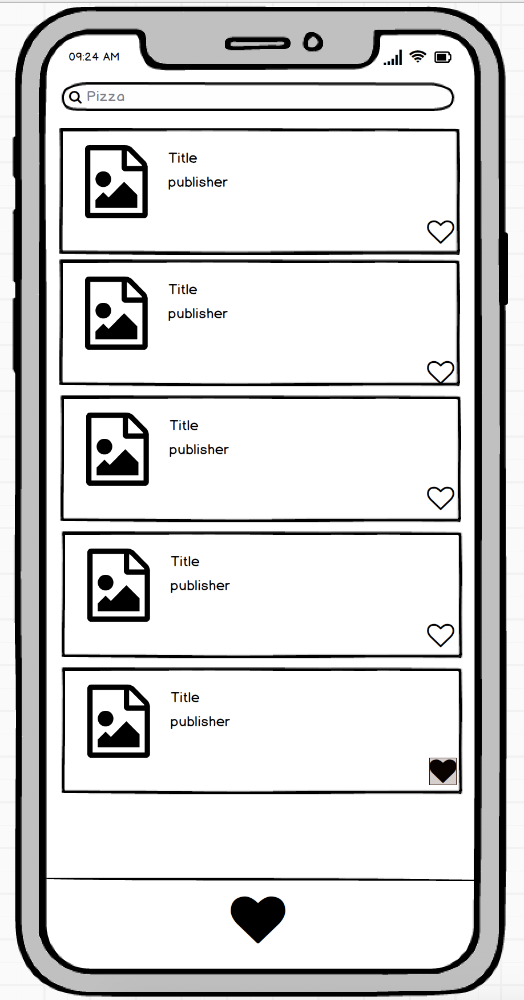

# Forkify Mobile Challenge 🏅

## Introdução

Este é um desafio para testar seus conhecimentos de Mobile;

O objetivo é avaliar a sua forma de estruturação e autonomia em decisões para construir algo escalável utilizando um framework moderno.

Você está livre para usar Android Kotlin, Swift iOS, Flutter ou React Native no desenvolvimento da solução deste tech challenge.

### Instruções iniciais obrigatórias

- Utilizar o seu github pessoal para publicar o desafio. Confirme que a visibilidade do projeto é pública (não esqueça de colocar no readme a referência a este challenge);

## Case

Vamos dar uma olhada em algumas receitas? A meta é criarmos um aplicativo de pesquisa de receitas, que consuma a API Forkify (https://forkify-api.herokuapp.com). O layout final deverá fica por sua conta, mas temos um exemplo para guiá-lo.

## Recursos

1. Estudar a documentação da REST API: https://forkify-api.herokuapp.com
2. Utilizar Android Kotlin, Swift iOS, Flutter ou React Native para construir a solução do Challenge;

4. Trabalhar em um repositório em seu usuário ou utilizar o seu github pessoal (não esqueça de colocar no readme a referência a este challenge);

## Readme do Repositório

- Deve conter o título do projeto
- Uma descrição sobre o projeto em frase
- Deve conter uma lista com linguagem, framework e/ou tecnologias usadas
- Como instalar e usar o projeto (instruções)
- Não esqueça o [.gitignore](https://www.toptal.com/developers/gitignore)
- Se está usando github pessoal, referencie que é um challenge by brn 
